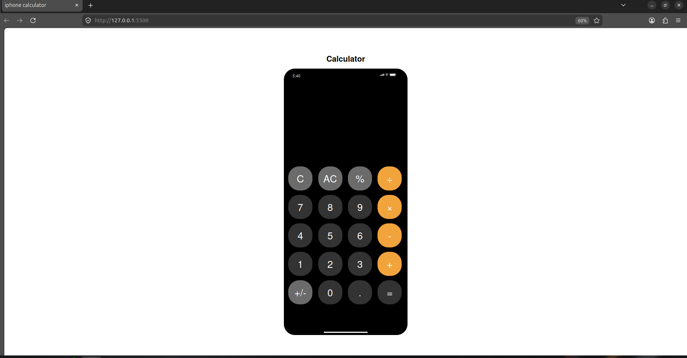

# Iphone Calculator

A simple web-based replica of an iphone calculator.

## 📌 Problem Statement

This calculator makes everyday calculations fast and easy. I supports basic arithmetic and percentage calculations, making it ideal for task like calculating business discounts. Its built-in history automatically saves previous calculations, helping you keep track of transactions without writing them down.

## 🎯 Project Goals

Create a clean responsive interface inspired by an iphone calculator.
Perform basic arithmetic and percentage calculations accurately.
Learn how to implement DOM manipulation and event handling in JavaScript.
Develop logical problem solving skills by using JavaScript functions and conditional statements.
Store and display calculation history for easy reference.
In simple terms, create a beautiful responsive user interface.

## 🛠 Tech Stack

Frontend: Vanilla HTML5, CSS3 and JavaScript.

## 🖥 Features

Basic arithmetic operations; addition, subtraction, multiplication and division.
Decimal support
Percentage and toggle function.
The back button to clear one character at a time.
The clear button to clear everything and reset the calculator.
On-screen number buttons for inputting numbers from 0 to 9.
Error handling for division by zero, infinity results and invalid expressions.
when an error occurs, all buttons are blocked except AC or clear button to reset.
Optimized with CSS3 to fit perfectly in all iphone sizes.

## 📷 Screenshots



## ⚙ Installation & Setup

```text
git clone https://github.com/Palvett/Iphone_calculator.git
```

cd Iphone-calculator

## 🧠 Challenges Faced

Understanding the DOM, that is Learning what the Document Object Model is and how JavaScript interacts with HTML elements.
Adding event listener which listens for click events on buttons and trigger the right function.
Preventing double operators from being typed and storing the operator for calculation.
The natural claculation solution was to use `eval()` to calculate the expression, but GitHub flags `eval()` as a severe code injection security risk. To resolve this, I securely replaced it by building a custom regular expression tokenizer using `expression.match(/(\d+\.?\d*)|([+\-*/])/g)` to safely parse and manually calculate numbers and operators.
When Error was displayed, all buttons needed to be blocked except AC to reset the calculator which was a big challenge.
Learning how to dynamically create list items with createElement and add them to the DOM using prepend.
After pressing =, typing a new number was appending to the result. Fixed using a justCalculated flag.

## 📚 What I Learned

Understood how JavaScript connects to and controls HTML elements in a page.
Using const to store references to elements like display and buttons.
Writing reusable funtions like adjustFontSize and caling them at the right time.
Using the arrow function which is a shorter function especially inside addEventListener and forEach loops where every button click needed its own callback function.
Using conditions to control what happens when buttons are clicked such as replacing zero and appending digits.
Using the display value slice to check the last character and delete with the "C" or back button.
Converting string values into real numbers that can be used to perform real calculations.
TextContent.trim which reads text on a button and removes any accidental whitespace around it.
Splitting of display values by operators using pop to grab the last number segment to check if they already contain a decimal point.
Using the for loop to loop between the tokenized operator to apply each operator to the result one step at a time.
Finally creating a list of elements with document.createElement and adding it to the top of the history list using historylist.prepend.

Future Improvements
I intend to use a "div" instead of input element in my HTML which means replacing display value with display.textContent which will allow long numbers to wrap onto the next line naturally.
I intend to replace the multiple if statements in the equals handler with a cleaner switch/case block for operator logic.
Plan to write JavaScript for updating the clock in the top bar every second so it displays current time while using the calculator.

## 👨🏽‍💻 Author

Fonba Palvett Blaise Kongnyuy  
Junior Fullstack Developer

- Email: palvettblaise406@gmail.com
- Location: Cameroon | Open to remote opportunities.
